<div align="center">

# 🔐 CipherChat Messenger

### Messaging that proves its guarantees.

**Self-hostable secure team messaging** for organizations that can't put sensitive
conversations in a third-party SaaS — legal clinics, healthcare practices, newsrooms.

*Exactly-once delivery you can watch survive a pod kill. DMs even the server admin can't read.*


[Why it's different](docs/WHY-DIFFERENT.md) ·
[Architecture](docs/ARCHITECTURE.md) ·
[9 ADRs](docs/adr/) ·
[Demo script](docs/DEMO.md) ·
[Interview review](docs/INTERVIEW-REVIEW.md)

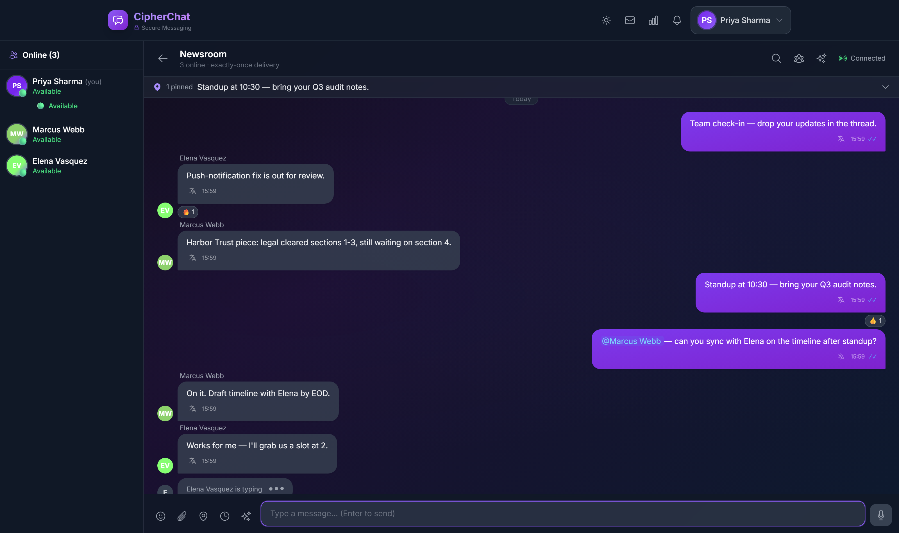

</div>

---

## Prove it in 60 seconds

```bash
docker compose -f docker-compose.scale.yml up --build -d   # LB → 2 replicas → Mongo + Redis
cd chat-back && npm run demo:failover                      # kills the socket-owning pod mid-stream
```

```
✓ every message persisted exactly once — 60 rows / 60 unique of 60
✓ sequence numbers gap-free & increasing — 1…60   (across the pod switch)
✓ Bob received every message exactly once — 0 duplicate events
  retried sends: 30 · reconnects alice=1 bob=1 · failover gap ≈ 2.4s
PASS — zero lost, zero duplicated across failover
```

<div align="center">
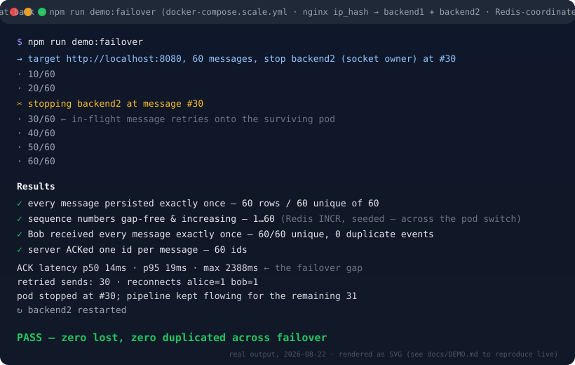
</div>

## The system in one diagram

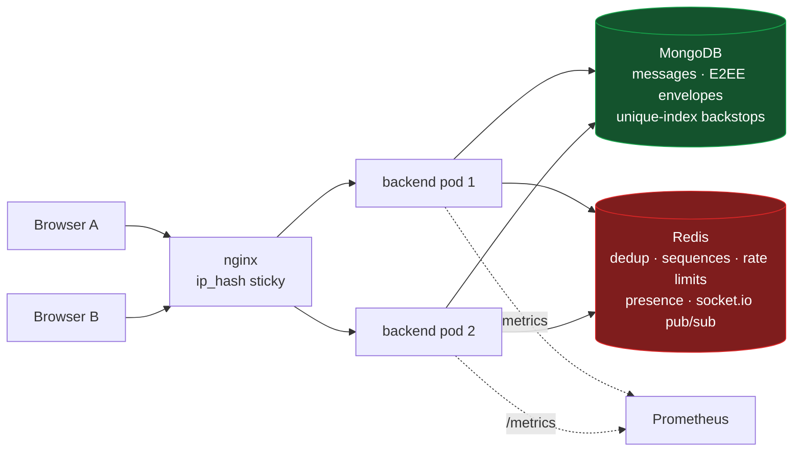

## The four load-bearing guarantees

| Guarantee | Mechanism | Proof |
|---|---|---|
| **Exactly-once persistence** over at-least-once transport | client UUID + ACK/retry w/ backoff → IndexedDB offline queue → Redis `SET NX` dedup → per-room `INCR` sequences → DB unique-index backstops | integration test double-sends the same UUID and asserts one row; `npm run demo:failover` kills a pod and asserts the ledger |
| **Operator-proof DMs** | X3DH-lite handshake, per-direction HMAC-SHA256 chains, AES-256-GCM with routing-bound AAD, 256-byte padding, session rotation (200 msgs / 7 days), safety numbers, 8-word recovery code — **attachments included** (per-file keys; the server stores an opaque blob and learns neither content nor file type) | crypto pinned to RFC 7748 / 8032 / 5869 + NIST GCM vectors; tamper/replay/out-of-order/rotation tests; verified live across isolated browser origins **and** by a headless protocol client (`chat-front/scripts/bob-headless.mts`); `db.dmmessages.find()` shows only ciphertext |
| **Failure survival** | 2+ replicas behind nginx `ip_hash`, `@socket.io/redis-adapter` fan-out, per-user rooms, seeded sequence counters, graceful `SIGTERM` drain (`closeIdleConnections`) | the failover verifier above — zero lost, zero duplicated, sequences continuous across the pod switch |
| **Content-free observability** | prom-client histograms + counters per pod, in-app live metrics dashboard (`/metrics` route) | every metric passes one test: *could this line reveal what someone said?* Counts, latencies, outcomes only |

## The product — one real session

Every shot below comes from a single scripted three-user session against a live
stack (Playwright driving three isolated browser contexts). The messages, unread
counts, latency numbers, safety number and ciphertext are all genuine state —
nothing is mocked or composited.

<table>
<tr>
<td width="50%" valign="top">
<strong>Encrypted DMs — with attachments.</strong> The green chip is load-bearing:
message bodies and the PDF travel as AES-256-GCM envelopes; name, size and key
ride <em>inside</em> the sealed payload.<br/><br/>
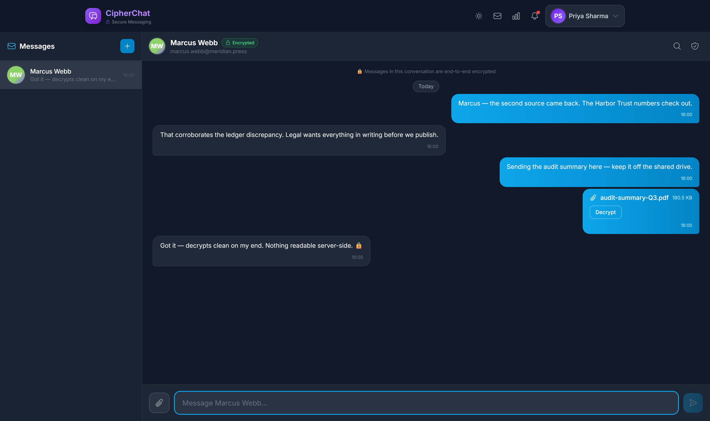
</td>
<td width="50%" valign="top">
<strong>Safety numbers.</strong> Signal-style 60-digit fingerprint of both
identity keys — compare out-of-band, mark verified, and any key change after
that raises a banner.<br/><br/>
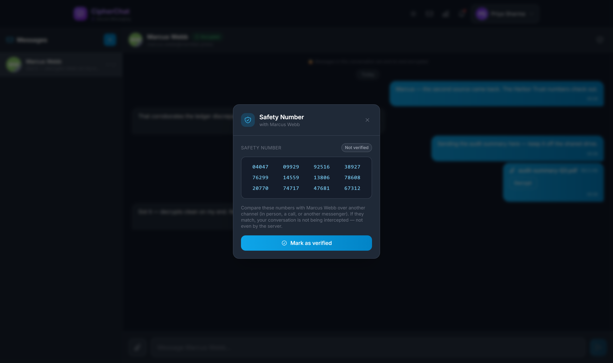
</td>
</tr>
<tr>
<td width="50%" valign="top">
<strong>One-time recovery code.</strong> Keys never leave the browser, so a new
device needs either this 8-group code (unwraps a server-held opaque blob) or an
explicit reset that peers can see.<br/><br/>
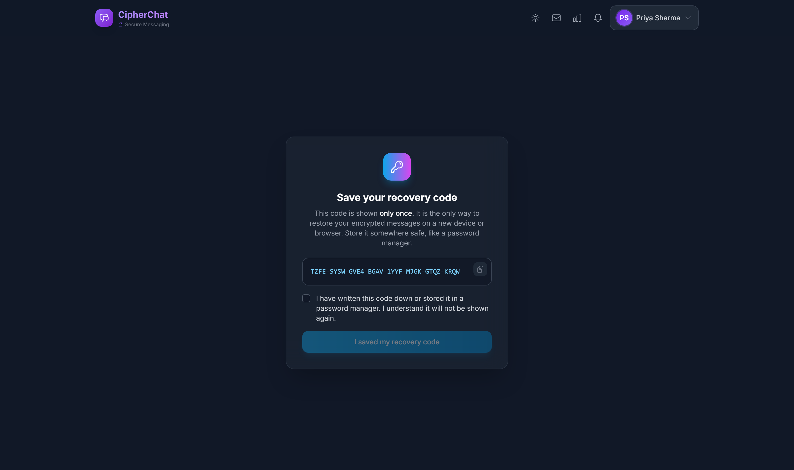
</td>
<td width="50%" valign="top">
<strong>Rooms dashboard.</strong> Membership roles, private rooms, and unread
watermarks computed from per-room read sequences — cross-replica, so badges
survive landing on a different pod.<br/><br/>
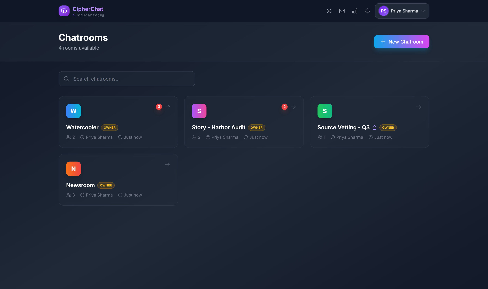
</td>
</tr>
<tr>
<td width="50%" valign="top">
<strong>Two-factor authentication.</strong> TOTP enrollment with QR + manual
secret, live-code confirmation, single-use backup codes — and a password-step
pending token the access-token verifier rejects by construction.<br/><br/>
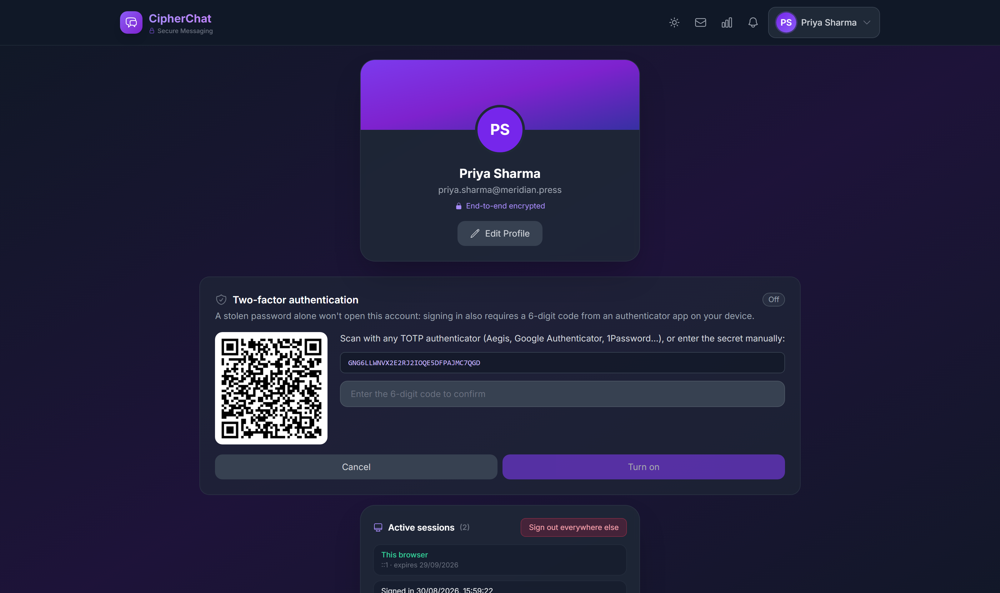
</td>
<td width="50%" valign="top">
<strong>Search the unsearchable.</strong> The server can't search ciphertext,
so DM search runs on-device over decrypted content — here matching a message
<em>and an attachment's filename that only ever existed inside the sealed
envelope</em>.<br/><br/>
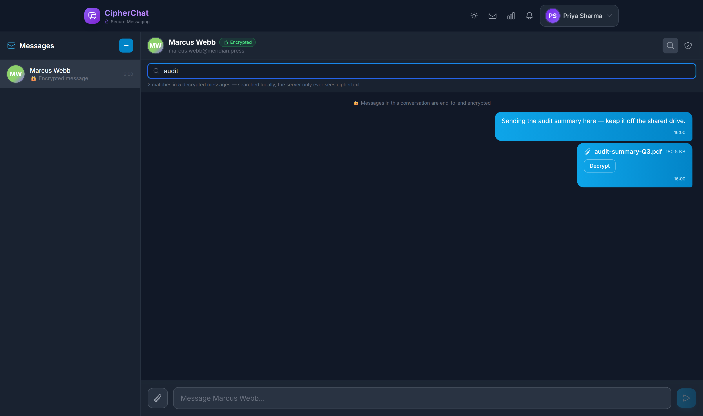
</td>
</tr>
<tr>
<td width="50%" valign="top">
<strong>Content-free observability.</strong> The in-app metrics page reads the
same registry Prometheus scrapes: delivery rate, dedup hits, live percentiles.
This session: 16/16 delivered, p95 156 ms.<br/><br/>
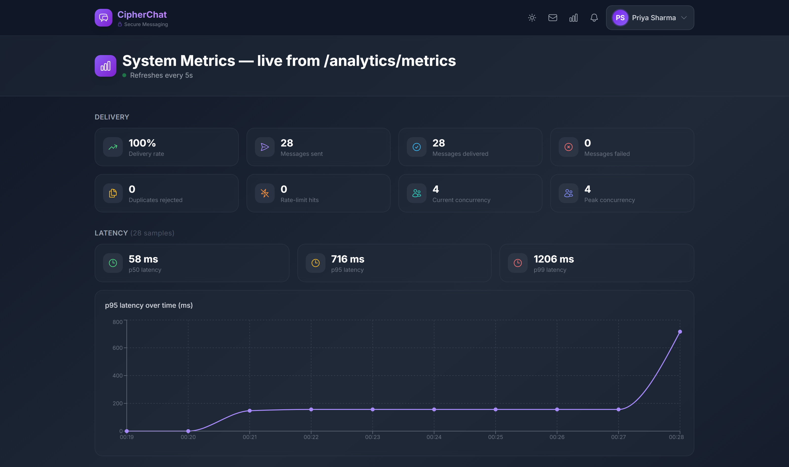
</td>
<td width="50%" valign="top">
<strong>The landing page states the same claims</strong> the docs defend and the
tests enforce — measured numbers, not adjectives.<br/><br/>
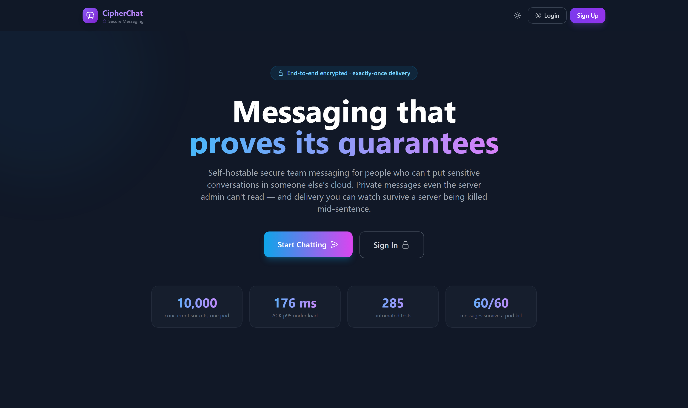
</td>
</tr>
</table>

**And here is that same DM conversation as the server stores it** — a real
document from the session above (`db.dmmessages.findOne()`):

```js
{
  conversationId:  ObjectId("6a94063c7c1c21ab58c489af"),
  senderId:        ObjectId("6a9406027c1c21ab58c4882d"),
  clientMessageId: "7073f258-63fa-446e-8c96-747c76dab316",   // exactly-once key
  type: "e2ee/v1",
  body: "",                                                  // never anything readable
  envelope: '{"v":1,"sessionId":"9a69f930-9056-4bfa-8490-ef2331ab83cd","ctr":0,
              "ct":"7rPAYdmK+j5WVlAx7HTJ06xEc0seeOoEqUP7Myoju7jUzC+rBZrcCdVQ1di/i2BqIZ…"}'
}
```

The PDF attachment message in that thread is byte-indistinguishable from the
text ones — same envelope shape, slightly bigger `ct`. The server learned
neither its name, its type, nor that it was a file at all.

## Measured, not claimed

Same-harness A/B and load numbers (methodology + caveats in [WHY-DIFFERENT](docs/WHY-DIFFERENT.md)):

| Measurement | Result |
|---|---|
| Connection density (`scripts/connflood.mts`): ramp + hold + probe on ONE pod | **10,000/10,000 concurrent sockets, zero failures**; 470 MB RSS (~47 KB/socket); message probe through the held load ACKed 200/200 at **p50 43 ms / p95 95 ms** |
| k6, 50 VUs across 10 rooms (~59 msg/s, 5× fan-out) via the LB | **ACK p95 176 ms** (p50 19 ms), 100% checks — threshold met |
| k6, 50 VUs in one hot room (50× fan-out ≈ 2,900 deliveries/s) | p95 2.55 s — the honest stress ceiling, with the fan-out math documented |
| Hot-path optimization A/B (`scripts/loadgen.mts`, identical harness) | send path 4–5 Mongo round-trips → 1: ACK p50 **284 → ~100 ms**, p95 **489 → ~195 ms** |
| Failover (auto-targeted socket-owning pod) | 60/60 exactly once, gap ≈ 2.4 s, steady-state ACK p50 14 ms |
| Frontend first load | chatroom chunk **526 → 107 KB** (emoji dataset lazy-loaded), vendor chunks cache-stable |

> The optimization pass exposed a latent sequence-counter race — which the DB's unique-index
> backstop caught exactly as designed. The full causal chain is in
> [INTERVIEW-REVIEW.md](docs/INTERVIEW-REVIEW.md): *optimizations change timing; timing changes
> expose races; backstops are why you have them.*

## Feature surface

- **Rooms** (server-readable team spaces): membership + roles (owner/admin/member), private
  rooms with invites, unread watermarks with dashboard badges, @mentions with cross-replica
  notifications, virtualized message list with cursor pagination, pinned messages, `$text`
  search, reactions, replies, edit/delete, self-destruct TTL messages, typing indicators as
  Redis TTL keys (a killed pod can't leave ghost typers), presence with heartbeat (no ghost
  online), AI summaries /
  reply suggestions / tone (Claude), file/voice/location messages.
- **DMs** (end-to-end encrypted): everything the server can't read — including attachments,
  which upload straight to object storage via presigned PUT when configured (the ciphertext
  never transits the app server) — with an encrypted sidebar preview cache, key-change
  banners, safety-number verification,
  restore/reset flows, an offline queue of pre-sealed envelopes, legacy-plaintext history
  clearly demarcated — and **on-device search**: the server can't search what it can't read,
  so search runs over the decrypted messages (and attachment names) on your device.
- **Auth & sessions:** 15-minute access tokens + rotating refresh cookie (hashed at rest,
  replay-after-rotation → 401 = theft tripwire), silent refresh, socket re-auth on reconnect,
  per-device session list with remote revocation ("sign out everywhere else"), and **TOTP
  two-factor auth** — QR enrollment, single-use backup codes, sealed seeds, and a scoped
  5-minute pending token that the access-token verifier rejects by construction
  ([ADR-0009](docs/adr/0009-totp-two-factor-auth.md)).

## Quickstart

```bash
# Full stack (Mongo + Redis + backend + frontend)
docker compose up --build            # app → http://localhost:3000

# Horizontal-scaling demo (nginx LB → 2 backend replicas)
docker compose -f docker-compose.scale.yml up --build

# Same, but websocket-only clients behind least_conn (no sticky sessions)
npm run stack:scale:ws
```

Local development — no Docker, no `.env` needed (the Vite proxy handles everything):

```bash
cd chat-back  && npm i && npm run dev    # needs DATABASE + SECRET in chat-back/.env
cd chat-front && npm i && npm run dev    # http://localhost:3000
```

Tips: open `http://127.0.0.1:3000` alongside `http://localhost:3000` for **two fully isolated
users in one browser** (separate origins → separate E2EE keys). Ports taken? `VITE_PORT=3100
VITE_DEV_API_TARGET=http://localhost:8100 npm run dev` + `PORT=8100 npm run dev` — the proxy
strips the Origin header, so no CORS config is ever needed in dev. Without `REDIS_URL` the
backend runs single-node on in-memory implementations of the same interfaces
([ADR-0002](docs/adr/0002-redis-behind-interfaces.md)).

## Tests & CI — 285 automated tests

```bash
cd chat-back  && npm test               # 132 unit + socket integration (mongodb-memory-server)
cd chat-front && npm test               # 153: components, hooks, offline queue, crypto KATs
k6 run load/k6-chat.js                  # threshold p95 ACK < 250ms (measured 176ms @ 10 rooms)
cd chat-back && npm run demo:failover   # the kill-a-pod assertion
cd chat-back && npx tsx scripts/loadgen.mts   # hot-room ACK-RTT percentiles (perf A/B harness)
```

CI (GitHub Actions): typecheck, lint, full suites — the Redis implementation suite runs against
a **real Redis service container** — plus production builds of both apps and both Docker images.
Crypto is pinned to **RFC 7748 / 8032 / 5869 and NIST GCM test vectors**, with tamper, replay,
out-of-order, and rotation-boundary suites, a committed golden transcript (byte-identical
re-seal), and WebCrypto↔noble interchangeability checks.

## Threat model (DMs)

| Protects against | How |
|---|---|
| Server operator / DB dump reading DMs | ciphertext-only storage (messages **and** attachments); keys never leave the browser |
| Network attacker | TLS + E2EE; AAD binds ciphertext to conversation/sender/session/counter |
| Ciphertext tampering or replay | GCM tag over AAD; client counter dedup + server unique `(conversation, session, ctr)` index |
| Key theft from a stolen DB | prekeys are public; refresh tokens & backups stored hashed/wrapped |

| Does NOT protect against | Why |
|---|---|
| Metadata (who ↔ whom, when, sizes beyond padding buckets) | routing requires it |
| A malicious client build served by the operator | inherent to web-delivered E2EE — stated, not hidden |
| Room content vs the operator | deliberate: server-side AI needs plaintext ([ADR-0004](docs/adr/0004-e2ee-dms-only.md)) |

## Repository layout

```
chat-back/    Express + Socket.IO + Mongoose (TypeScript, strict)
  src/sockets/       typed event maps + per-domain handlers
  src/shared/        reliability layer: interfaces + in-memory + Redis impls
  src/storage/       file storage: interface + local-disk + S3-compatible drivers
  src/services/      room authorization authority · hot-path caches
  scripts/           failover verifier · load generator
  tests/             unit + integration (mongodb-memory-server, socket.io-client)
chat-front/   React 18 + Vite + Tailwind (TypeScript, strict)
  src/crypto/        E2EE: RFC-vectored primitives, X3DH-lite, chains, envelopes, file crypto
  src/services/      E2EEService, offline queue (IndexedDB v2), API client
  scripts/           headless E2EE protocol client (bob-headless.mts)
docs/         WHY-DIFFERENT · ARCHITECTURE · DEMO · INTERVIEW-REVIEW · adr/ (9 ADRs)
deploy/       nginx LB config          load/    k6 script
```

<div align="center">

MIT licensed · built as an exercise in **proving** systems claims, not just making them

</div>
