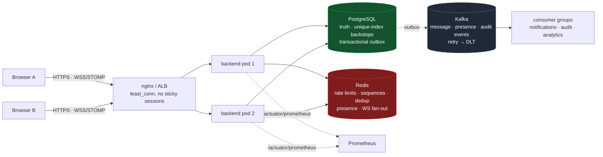

<div align="center">

# 🔐 CipherChat Messenger

### Messaging that proves its guarantees.

**Self-hostable secure team messaging** for organizations that can't put sensitive
conversations in a third-party SaaS — legal clinics, healthcare practices, newsrooms.

*Exactly-once delivery enforced by the database. DMs even the server admin can't read.*


[Why it's different](docs/WHY-DIFFERENT.md) ·
[Architecture](docs/ARCHITECTURE.md) ·
[System design](docs/SYSTEM_DESIGN.md) ·
[API](docs/API.md) ·
[10 ADRs](docs/adr/) ·
[Demo script](docs/DEMO.md)


</div>

---

## The system in one diagram



One **Java 21 / Spring Boot 4 modular monolith** (Spring Modulith — module boundaries fail the build when violated) in front of three stores with three distinct jobs: **Postgres is truth, Redis is coordination, Kafka is everything that happens afterwards.** Details: [ARCHITECTURE.md](docs/ARCHITECTURE.md), [ADR-0010](docs/adr/0010-java-spring-modular-monolith.md).

## The four load-bearing guarantees

| Guarantee | Mechanism | Where it is enforced |
|---|---|---|
| **Exactly-once persistence** over at-least-once transport | client UUID + ACK/retry → IndexedDB offline queue → Redis `SET NX` dedup → seeded per-room `INCR` sequence → **`UNIQUE (room, sequence)` and `UNIQUE (client_message_id)`** | the database. Redis only makes the common case fast; the unique indexes make a wrong counter or a missed dedup impossible to persist. `MessagingIT` double-sends and asserts one row |
| **Operator-proof DMs** | X3DH-lite, per-direction HMAC-SHA256 chains, AES-256-GCM with routing-bound AAD, padding, session rotation — attachments included | client crypto pinned to RFC/NIST vectors; server verifies the **Ed25519 prekey signature**, validates envelope structure, and enforces **`UNIQUE (conversation, sender, sessionId, ctr)`** — a counter is spent once, cluster-wide. `DirectMessageIT` replays a counter and gets `409 replayed_counter` |
| **Failure survival** | stateless pods, Redis pub/sub fan-out, graceful drain (`maxUnavailable: 0`, preStop, grace > shutdown), **transactional outbox** so Kafka being down never fails a send, idempotent consumers with a `processed_events` ledger and DLT | `docker compose … --scale backend=2` and kill a pod; publications queue in Postgres and replay; `KafkaConsumersIT` |
| **Content-free observability** | Actuator + Micrometer → Prometheus; `cipherchat.*` counters and p50/p95/p99 send latency; structured JSON logs with correlation ids; in-app metrics page | every metric passes one test: *could this line reveal what someone said?* Counts, latencies, outcomes only |

## The product — one real session

Every shot below comes from a single scripted three-user session against a live
stack (Playwright driving three isolated browser contexts). The messages, unread
counts, safety number and ciphertext are genuine state — nothing is mocked or
composited. The captures predate the Java backend: the pages are unchanged, but
the numbers on the metrics screenshot were produced by the previous Node
implementation (see *Verification status* below for what the Java backend has
been measured on).

<table>
<tr>
<td width="50%" valign="top">
<strong>Encrypted DMs — with attachments.</strong> The green chip is load-bearing:
message bodies and the PDF travel as AES-256-GCM envelopes; name, size and key
ride <em>inside</em> the sealed payload.<br/><br/>

</td>
<td width="50%" valign="top">
<strong>Safety numbers.</strong> Signal-style 60-digit fingerprint of both
identity keys — compare out-of-band, mark verified, and any key change after
that raises a banner.<br/><br/>

</td>
</tr>
<tr>
<td width="50%" valign="top">
<strong>One-time recovery code.</strong> Keys never leave the browser, so a new
device needs either this 8-group code (unwraps a server-held opaque blob) or an
explicit reset that peers can see.<br/><br/>

</td>
<td width="50%" valign="top">
<strong>Rooms dashboard.</strong> Membership roles, private rooms, and unread
watermarks computed from per-room read sequences — cross-replica, so badges
survive landing on a different pod.<br/><br/>

</td>
</tr>
<tr>
<td width="50%" valign="top">
<strong>Two-factor authentication.</strong> TOTP enrollment with QR + manual
secret, live-code confirmation, single-use backup codes — and a password-step
pending token the access-token verifier rejects by construction.<br/><br/>

</td>
<td width="50%" valign="top">
<strong>Search the unsearchable.</strong> The server can't search ciphertext,
so DM search runs on-device over decrypted content — here matching a message
<em>and an attachment's filename that only ever existed inside the sealed
envelope</em>.<br/><br/>

</td>
</tr>
<tr>
<td width="50%" valign="top">
<strong>Content-free observability.</strong> The in-app metrics page reads the
same registry Prometheus scrapes: delivery rate, dedup hits, live percentiles.<br/><br/>

</td>
<td width="50%" valign="top">
<strong>The landing page states the same claims</strong> the docs defend and the
tests enforce — measured numbers, not adjectives.<br/><br/>

</td>
</tr>
</table>

**And here is a DM as the server stores it** — one row of `dm_messages`:

```sql
 id  | conversation_id | sender_id | client_message_id                    | type    | body | envelope
-----+-----------------+-----------+--------------------------------------+---------+------+------------------------------------------------------------------
 412 | 0f3c…c11        | 9b21…e07  | 7073f258-63fa-446e-8c96-747c76dab316 | e2ee/v1 |      | {"v":1,"sessionId":"9a69f930-…","ctr":0,"ct":"7rPAYdmK+j5WVlAx7HTJ06xEc0se…"}
```

The unique index on `(conversation_id, sender_id, envelope->>'sessionId', (envelope->>'ctr')::bigint)` is the server's whole cryptographic contribution to the conversation — and the only one it needs.

## Stack

| Layer | Choice | Why |
|---|---|---|
| Language / framework | Java 21 (virtual threads), Spring Boot 4.1, Spring Modulith | one deployable, compile-time module boundaries, event-driven internals |
| Data | PostgreSQL 17 + Flyway, Hibernate `validate` only | invariants as constraints; schema owned by migrations |
| Coordination | Redis 7 (Lua token bucket, INCR sequences, SET NX dedup, TTL presence, pub/sub) | shared across replicas; never a source of truth |
| Events | Kafka (KRaft) via Modulith transactional outbox; idempotent consumer groups; exponential retry → DLT | durable "afterwards" without touching the send path |
| Real-time | STOMP over WebSocket, simple broker, Redis cross-pod bridge | no polling fallback → no sticky sessions |
| Security | Spring Security, HS256 JWT (15 min), rotating hashed refresh tokens, BCrypt(12), TOTP 2FA, RBAC | [SECURITY.md](docs/SECURITY.md) |
| Attachments | `local` or S3/MinIO driver; presigned PUT for encrypted blobs | ciphertext never transits the app |
| Resilience | Resilience4j (LLM client), Kafka DLT, rate limiter fail-open | degrade, don't cascade |
| Observability | Actuator, Micrometer/Prometheus, ECS JSON logs, `X-Request-Id` | content-free by construction |
| Frontend | React 19 + Vite + TypeScript + Tailwind; E2EE client in `src/crypto` | unchanged pages; one STOMP adapter |
| Delivery | Docker (layered, non-root), Compose (+ scale-out), Kubernetes (HPA/PDB/probes), Terraform (AWS), Render blueprint, GitHub Actions | [DEPLOYMENT.md](docs/DEPLOYMENT.md) |

## Quickstart

```bash
docker compose up --build                       # Postgres + Redis + Kafka + backend + frontend → http://localhost:3000
docker compose -f docker-compose.yml -f docker-compose.scale.yml up --build --scale backend=2   # nginx least_conn → 2 replicas
docker compose --profile s3 up --build          # + MinIO, uploads via the S3 driver
```

Backend from the IDE with dependencies in Docker, and everything about local work: [LOCAL_DEVELOPMENT.md](docs/LOCAL_DEVELOPMENT.md). API reference: `/swagger-ui.html` on a running backend, or [API.md](docs/API.md).

## Tests & CI

```bash
cd backend && ./mvnw test        # unit + Modulith boundary tests (no Docker)
cd backend && ./mvnw verify      # + Testcontainers integration tests: real Postgres, Redis, Kafka, STOMP
cd chat-front && npm test        # components, hooks, offline queue, crypto known-answer tests
```

Integration suites exercise the *contract*, not the code: auth rotation and replayed-cookie rejection, double-send absorption with gapless sequences, private-room 403s, E2EE replay `409`, a Kafka-fed notification appearing exactly once, a STOMP send ACKed and broadcast to another socket. CI runs them against service containers, gates coverage with JaCoCo, formats with Spotless, scans lockfiles and images with Trivy, publishes images to GHCR and deploys through a manually approved environment.

Crypto (client) is pinned to **RFC 7748 / 8032 / 5869 and NIST GCM test vectors**, with tamper, replay, out-of-order and rotation-boundary suites and a committed golden transcript. The server's TOTP is checked against the **RFC 6238** vectors.

## Verification status

Every row below was produced in this repository's state, on one Windows 11 laptop (12 CPUs, Docker Desktop VM with 8 GB). VERIFIED means executed and observed; DESIGNED means implemented and reviewed but not exercised end to end; NOT VERIFIED means it needs infrastructure this repository does not own.

| Claim | Status | Evidence |
|---|---|---|
| Backend compiles; unit + Modulith boundary tests | VERIFIED | `./mvnw clean test` — 27 tests, 0 failures |
| Integration suites against real Postgres 17, Redis 7, Kafka (Testcontainers) | VERIFIED | `./mvnw verify` — 23 tests in 6 suites, 0 failures, JaCoCo gate met (60 % lines, 43 % branches) |
| Exactly-once persistence (same `clientMessageId` twice → one row, `duplicate:true`) | VERIFIED | `MessagingIT`, `StompGatewayIT` |
| E2EE replay backstop (`(conversation, sender, sessionId, ctr)` reused → `409 replayed_counter`) | VERIFIED | `DirectMessageIT` |
| STOMP: JWT at CONNECT, ACK + broadcast, outsider `SUBSCRIBE` refused | VERIFIED | `StompGatewayIT` |
| Kafka: outbox → consumer → one side effect; duplicate event delivery → one row; poison record → DLT; failing side effect retried then dead-lettered | VERIFIED | `KafkaConsumersIT`, `KafkaResilienceIT` |
| Frontend typecheck, lint, tests, production build | VERIFIED | 153 Vitest tests, 0 lint errors, `vite build` |
| Dependency vulnerabilities (frontend lockfile) | VERIFIED | Trivy: 0 HIGH/CRITICAL after upgrading axios and react-router |
| Secrets in the tree | VERIFIED | Trivy secret scan over every source directory: none; `git grep` for key/credential patterns: none |
| Backend image builds from an empty cache | VERIFIED | `docker compose build --no-cache backend` — twice: the first image built but could not start (layered-jar launcher layout, fixed), the rebuilt image was not observed starting before the environment failed (next row) |
| Kubernetes manifests | DESIGNED | kubeconform: 11 objects valid against the 1.30 schemas; not applied to a cluster |
| Terraform | DESIGNED | `terraform fmt`, `init`, `validate` pass; not planned or applied against an AWS account |
| Compose stack end to end, Redis/Kafka failure drills, two-replica fan-out, k6 latency, image scan, `EXPLAIN` of the hot queries | NOT VERIFIED | the host disk filled during the image build, the Docker VM went read-only and WSL wedged past what a non-elevated session can reset. Everything is scripted: `bash scripts/verify-all.sh` runs all of it and writes `docs/VERIFICATION-RUN.md` |
| Render deployment | NOT VERIFIED | the exact image was built and started locally; the hosted deploy was not observed (no Render account/logs) |
| GitHub Actions run | NOT VERIFIED | workflow is structurally validated; it has not run on a pushed commit |
| 10,000 concurrent sockets / 200 msg/s / p95 < 250 ms | DESIGN TARGETS | the 10k figure was measured on the previous Node implementation ([WHY-DIFFERENT.md](docs/WHY-DIFFERENT.md)); not re-measured here |

## Threat model (DMs)

| Protects against | How |
|---|---|
| Server operator / DB dump reading DMs | ciphertext-only storage (messages **and** attachments); keys never leave the browser |
| Network attacker | TLS + E2EE; AAD binds ciphertext to conversation/sender/session/counter |
| Ciphertext tampering or replay | GCM tag over AAD; client counter dedup + server unique `(conversation, sender, session, ctr)` index |
| Mixed-and-matched key bundles | the directory verifies the prekey signature with the identity key before storing |
| Key theft from a stolen DB | prekeys are public; refresh tokens hashed; TOTP seeds sealed; backups client-encrypted |

| Does NOT protect against | Why |
|---|---|
| Metadata (who ↔ whom, when, sizes beyond padding buckets) | routing requires it |
| A malicious client build served by the operator | inherent to web-delivered E2EE — stated, not hidden |
| Room content vs the operator | deliberate: server-side AI and search need plaintext ([ADR-0004](docs/adr/0004-e2ee-dms-only.md)) |

## Documentation

| | |
|---|---|
| [ARCHITECTURE.md](docs/ARCHITECTURE.md) | modules, request paths, real-time layer, cross-cutting concerns |
| [SYSTEM_DESIGN.md](docs/SYSTEM_DESIGN.md) | requirements → estimates → deep dives → failure modes |
| [DATABASE_DESIGN.md](docs/DATABASE_DESIGN.md) | schema, the indexes that carry the guarantees, connection budget |
| [KAFKA_DESIGN.md](docs/KAFKA_DESIGN.md) | topics, outbox, idempotent consumers, retry/DLT |
| [SCALABILITY.md](docs/SCALABILITY.md) | target envelope, stateless-replica rule, what scales how, honest limits |
| [SECURITY.md](docs/SECURITY.md) | auth, authz, input handling, secrets, audit, E2EE server role |
| [API.md](docs/API.md) | REST + STOMP map; OpenAPI is the source of truth |
| [DEPLOYMENT.md](docs/DEPLOYMENT.md) | Render (with the root-cause analysis of the failed deploys), Compose, AWS/Kubernetes |
| [LOCAL_DEVELOPMENT.md](docs/LOCAL_DEVELOPMENT.md) | run it, test it, environment variables, troubleshooting |
| [PHASE1_AUDIT.md](docs/PHASE1_AUDIT.md) | what the previous implementation looked like and why it was replaced |
| [adr/](docs/adr/) | 10 architecture decision records |

## Repository layout

```
backend/        Java 21 · Spring Boot 4 modular monolith (Maven wrapper included)
  src/main/java/com/cipherchat/
    shared/        error contract · principal · events · Redis primitives · Kafka policy · metrics
    user/ auth/    accounts · JWT/refresh/sessions · TOTP 2FA · audit publishing
    chatroom/      rooms · exactly-once messages · receipts · search
    dm/ keys/      E2EE conversations · key directory
    gateway/       STOMP endpoint · Redis fan-out · presence gateway
    presence/      online registry · typing · roster
    notification/ audit/ analytics/   Kafka consumers + read APIs
    upload/ ai/    storage drivers · LLM client (any chat-completions endpoint) behind a circuit breaker
  src/main/resources/db/migration/   Flyway schema
  src/test/java/ unit · Modulith boundary · Testcontainers *IT
chat-front/     React 19 + Vite + TypeScript (E2EE client in src/crypto, STOMP adapter in src/services/stompSocket.ts)
infrastructure/ kubernetes/ (kustomize) · terraform/ (AWS) · nginx/ (scale-out LB)
docs/           design docs · adr/ · media/
docker-compose.yml · docker-compose.scale.yml · render.yaml · .github/workflows/ci.yml
```

<div align="center">

MIT licensed · built as an exercise in **proving** systems claims, not just making them

</div>
