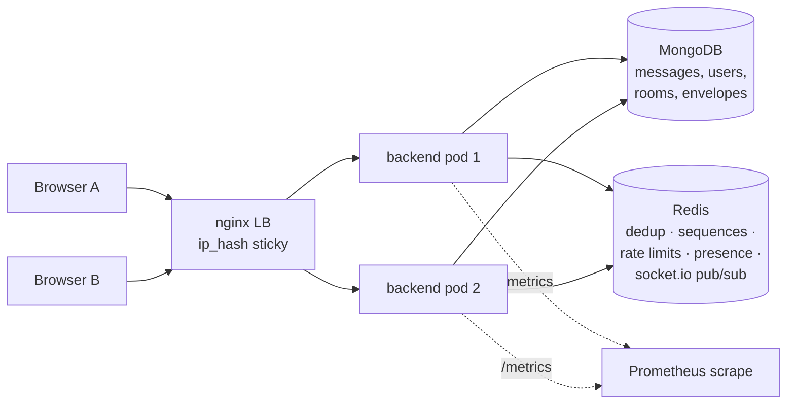
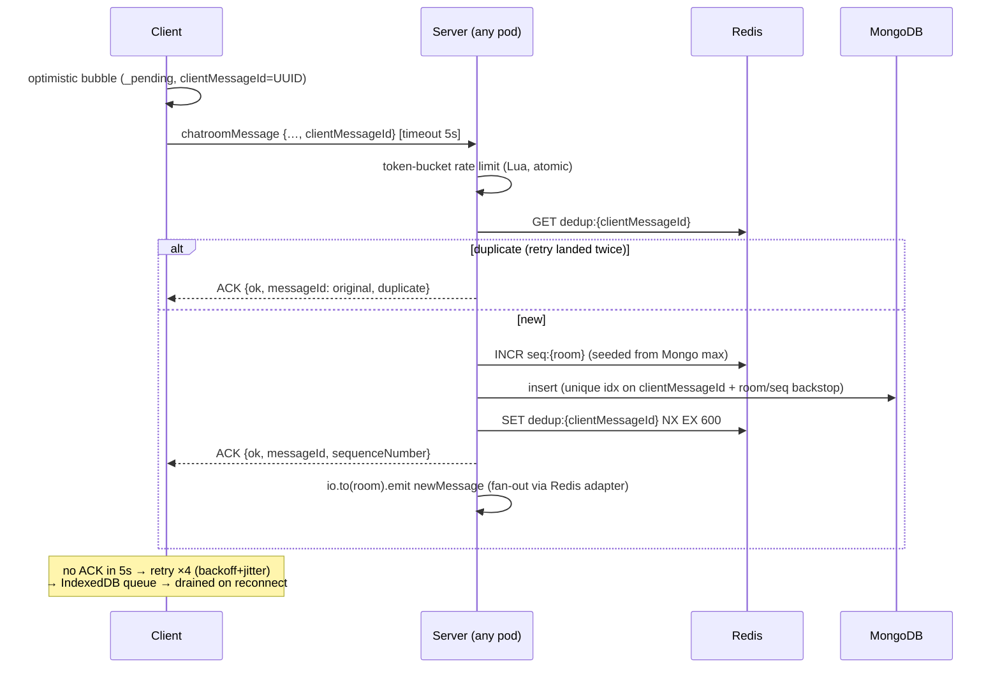
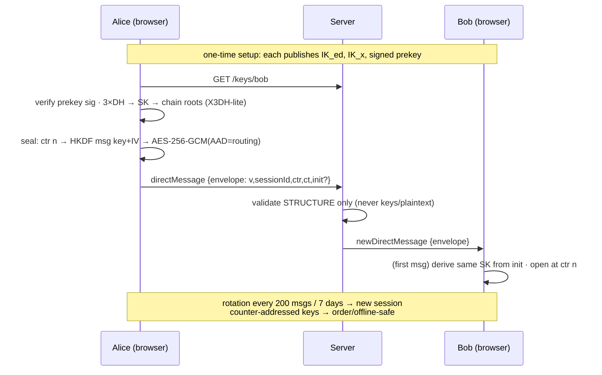

# CipherChat — Architecture

Self-hostable secure team messaging. Two apps (`chat-back` Express +
Socket.IO + Mongoose, `chat-front` React + Vite), MongoDB for persistence,
Redis for cross-replica coordination. Every decision below has an ADR in
`docs/adr/` with the rejected alternatives.

## System topology (scale-out deployment)

- `ip_hash` keeps Socket.IO's long-polling fallback pinned to one pod;
  message fan-out **between** pods rides the Redis adapter, not nginx.
- Per-user rooms (`user:{id}`) address "all of this user's sockets" across
  every pod — raw socketId targeting silently dropped cross-pod messages.
- `docker-compose.scale.yml` runs this exact topology locally; killing
  `backend1` mid-conversation is the standard demo.

## Message delivery pipeline (rooms)

Five layers, each covering the one above: ACK/retry → offline queue →
Redis dedup → per-room sequences → DB unique indexes (ADR-0007).

## E2EE handshake and message flow (DMs)

The server stores ciphertext envelopes it can never read; sidebar previews
are a client-side encrypted cache; safety numbers (Signal's 60-digit format)
verify identities; an 8-word recovery code restores keys on a new browser.
Rooms are deliberately NOT E2EE — that's the AI-features trade, ADR-0004.

## Auth

15-minute HS256 access tokens + 30-day rotating refresh cookie (httpOnly,
hash-at-rest, replay-after-rotation = theft signal → 401). Axios silently
refreshes and replays once; the socket handshake re-reads the token on every
reconnect. ADR-0005.

## Authorization (rooms)

`services/roomAccess.ts` is the single authority: public rooms admit any
authenticated user (joining records participation), private rooms admit
members only — enforced identically in REST controllers and socket handlers.
Roles: owner → admin → member; invites need admin+, role changes owner-only,
ownership transfer demotes the previous owner.

## Data model (core collections)

| Collection | Purpose | Load-bearing indexes |
|---|---|---|
| `messages` | room messages | `{chatroom, _id}` cursor pagination; unique partial `{chatroom, sequenceNumber}`; unique partial `clientMessageId`; TTL on `expiresAt` |
| `dmmessages` | DM envelopes + legacy plaintext | `{conversationId, createdAt}`; unique `{conversationId, clientMessageId}` |
| `chatrooms` | rooms + embedded members[] | unique `name`; `members.user` |
| `roomreadstates` | per-user unread watermark | unique `{user, chatroom}` |
| `users` | identity + presence + E2EE key directory | unique `email` |
| `refreshtokens` | session store (hashes) | unique `tokenHash`; TTL `expiresAt` |

## Scaling milestones

| Trigger | Change |
|---|---|
| >4 pods / multi-node Redis pressure | Redis Cluster; move presence to its own keyspace |
| Sustained >500 msg/s | Queue (Kafka) between socket ingest and persistence; batch inserts |
| History >100 GB | Room-based sharding; move media to S3 + presigned URLs |
| Multi-org SaaS mode | Tenant id on every collection + per-tenant rate budgets (today: one org per deployment, by design) |
