# Low-Level Design

Class-level design of CipherChat: the objects that carry each guarantee, the exact sequence of calls on the hot paths, the state machines, and the transaction and locking boundaries. Every name below is a real class, method, table, index or STOMP destination in this repository; nothing is aspirational. The high-level picture is in [SYSTEM_DESIGN.md](SYSTEM_DESIGN.md) and [ARCHITECTURE.md](ARCHITECTURE.md); the schema in [DATABASE_DESIGN.md](DATABASE_DESIGN.md); the tests that pin each behaviour in [TESTING.md](TESTING.md).

Contents

1. [Backend module structure](#1-backend-module-structure)
2. [Class design: the send path](#2-class-design-the-send-path)
3. [Sequence: room message, exactly once](#3-sequence-room-message-exactly-once)
4. [Sequence: cross-replica fan-out](#4-sequence-cross-replica-fan-out)
5. [Sequence: the "afterwards" pipeline (outbox → Kafka → consumers)](#5-sequence-the-afterwards-pipeline)
6. [Sequence: encrypted direct message](#6-sequence-encrypted-direct-message)
7. [Sequence: authentication and refresh rotation](#7-sequence-authentication-and-refresh-rotation)
8. [Sequence: STOMP connect and authorisation](#8-sequence-stomp-connect-and-authorisation)
9. [State machines](#9-state-machines)
10. [Client design](#10-client-design)
11. [Transactions, locks and idempotency: the complete list](#11-transactions-locks-and-idempotency)
12. [Error model](#12-error-model)
13. [Concurrency and resource limits](#13-concurrency-and-resource-limits)

---

## 1. Backend module structure

One Spring Boot process; Spring Modulith turns each top-level package under `com.cipherchat` into a module whose allowed dependencies are declared in its `package-info.java` and enforced by `ModularityTests` (the build fails on a violation).

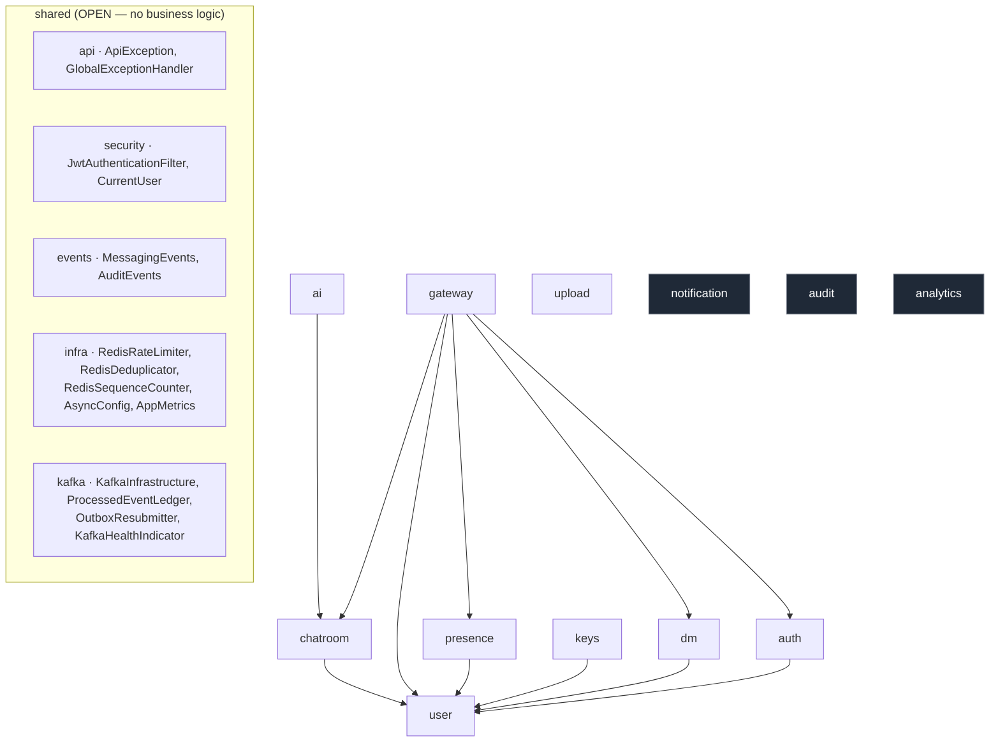

Modules never call each other's internals; they call each other's public services (`ChatroomService.assertAccess`, `DmService.requireParticipant`, `UserService.require`) or communicate through the event records in `shared.events`, which are simultaneously the in-process events and the Kafka wire format.

## 2. Class design: the send path

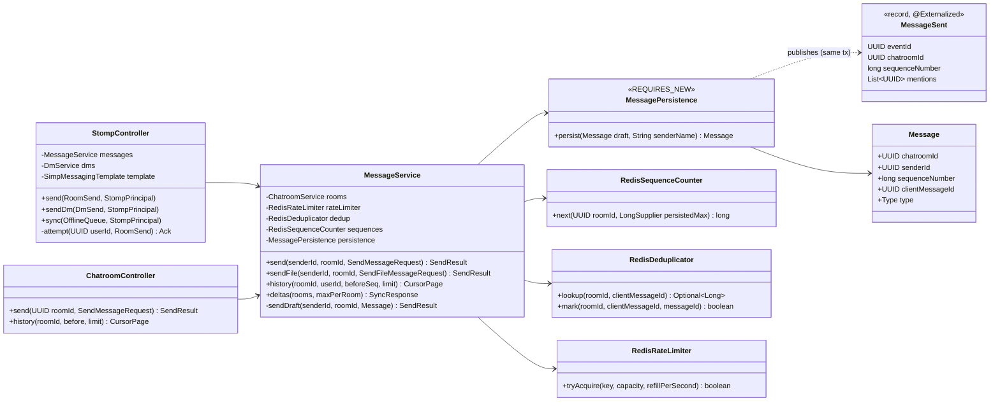

Design points that the class shapes encode:

- **`MessagePersistence` is its own bean with `REQUIRES_NEW`.** A `DataIntegrityViolationException` from a unique index marks the *current* transaction rollback-only. If the insert ran inside `MessageService`'s transaction, the service could not then query for the existing row and answer `duplicate: true` — the whole request would be dead. Isolating the insert lets the caller interpret the failure after the inner transaction has rolled back. `DmService.Persistence` exists for the same reason.
- **The domain event is published inside the persisting transaction.** `MessagePersistence.persist` calls `events.publishEvent(MessageSent)` before returning; Spring Modulith writes the event to `event_publication` in that same transaction. A message row and its outbox row commit atomically or not at all — that is the transactional outbox.
- **Both STOMP and REST converge on one `MessageService.send`.** The transport differs (ACK frame vs HTTP body) but the idempotency, sequencing and persistence code path is identical, so a retry over the other transport is still absorbed.
- **Redis classes carry an explicit failure policy each.** `RedisRateLimiter` and `RedisDeduplicator` *fail open* (Redis down → allow / fall through to the unique index). `RedisSequenceCounter` *fails closed* (Redis down → `503 redis_unavailable`), because a guessed sequence would only be caught after the fact.

## 3. Sequence: room message, exactly once

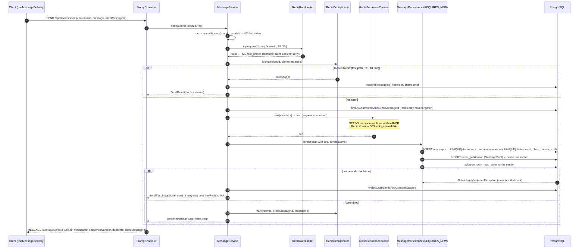

Why the sequence cannot go wrong even though it is handed out before the commit: the row carries `UNIQUE (chatroom_id, sequence_number)`. If Redis were ever reseeded from a stale maximum, the second writer to a slot fails the insert rather than producing two messages with one sequence. The unique index is the guarantee; Redis only makes the common case one round trip.

Known gap, stated in the audit: sequences are allocated before commit, so a slower transaction holding `seq 7` can commit after `seq 8`. A delta-sync client that already advanced its cursor to 8 would skip 7. Live broadcast order can also briefly invert. Not fixed in this pass; the honest mitigation is a trailing re-read window on sync.

## 4. Sequence: cross-replica fan-out

Spring's simple STOMP broker only knows the sessions on its own JVM. Every broadcast therefore goes through Redis pub/sub so that N replicas behave as one broker, with no sticky sessions.

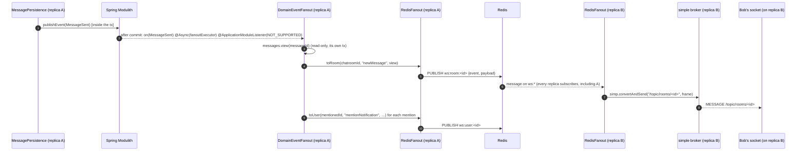

- The listener runs **after commit** (Modulith `@ApplicationModuleListener`), so a subscriber can never see a frame for a row that later rolled back.
- `propagation = NOT_SUPPORTED` plus a dedicated `fanoutExecutor`: the listener holds no connection and never blocks the committing thread (both were load-only defects fixed in the benchmark pass, [BENCHMARKS.md](BENCHMARKS.md)).
- Channels: `ws:room:<id>`, `ws:dm:<id>`, `ws:user:<id>`, `ws:all`. Redis pub/sub is fire-and-forget by design: a client that misses a frame catches up from `POST /api/v1/sync/rooms` on reconnect ([ADR-0014](adr/0014-delta-sync-and-background-flush.md)).

## 5. Sequence: the "afterwards" pipeline

Durable side effects (the notification inbox, the audit log, analytics counters) go through Kafka, not pub/sub, because they must survive an outage and must happen exactly once.

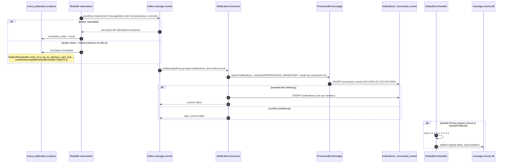

The exactly-once claim for consumers rests on one rule: **the ledger claim and the side effect commit in the same database transaction.** If the side effect fails, the claim rolls back with it and the retry starts clean; if the offset commit is lost after a successful transaction, the redelivery hits the conflict and is skipped. `ProcessedEventLedger.sweep` bounds the table to Kafka's retention.

## 6. Sequence: encrypted direct message

The server's only cryptographic duties are to verify prekey signatures at publish time, validate envelope *structure*, and enforce the replay index. Everything else happens in the browser.

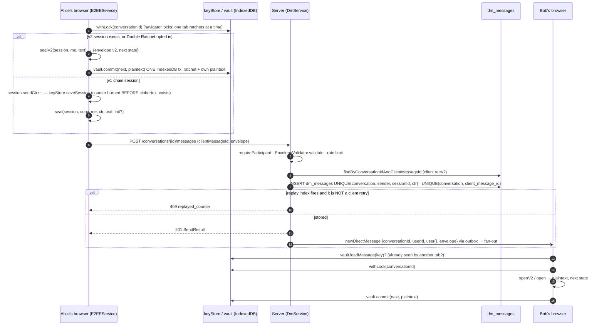

Two invariants that the ordering in this diagram protects:

1. **A counter or message key is never reused.** The v1 counter is persisted before the ciphertext exists; the v2 ratchet advances and commits together with the plaintext it produced, in one IndexedDB transaction (`vault.commit`). A crash between those steps burns a number; it can never reuse one. Nonce reuse under AES-GCM would be catastrophic, so this ordering is load-bearing.
2. **Decrypt is transactional.** `ratchetDecrypt` returns the next state; the caller commits it only after decryption succeeded. A forged or corrupted frame therefore never advances the ratchet.

## 7. Sequence: authentication and refresh rotation

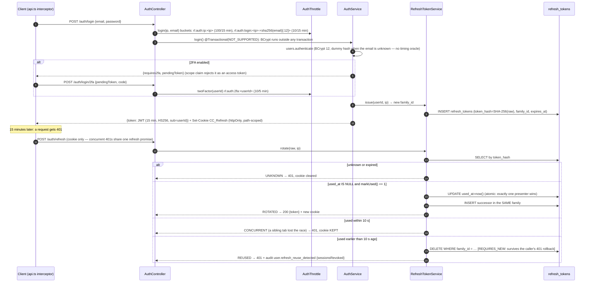

The family model is what makes reuse detection *do* something: the thief and the owner hold tokens of the same family, the server cannot tell them apart, so it signs both out. The 10 s grace window exists because two tabs sharing one cookie legitimately present the same token within moments of each other; inside it the loser is refused but nothing is revoked.

## 8. Sequence: STOMP connect and authorisation

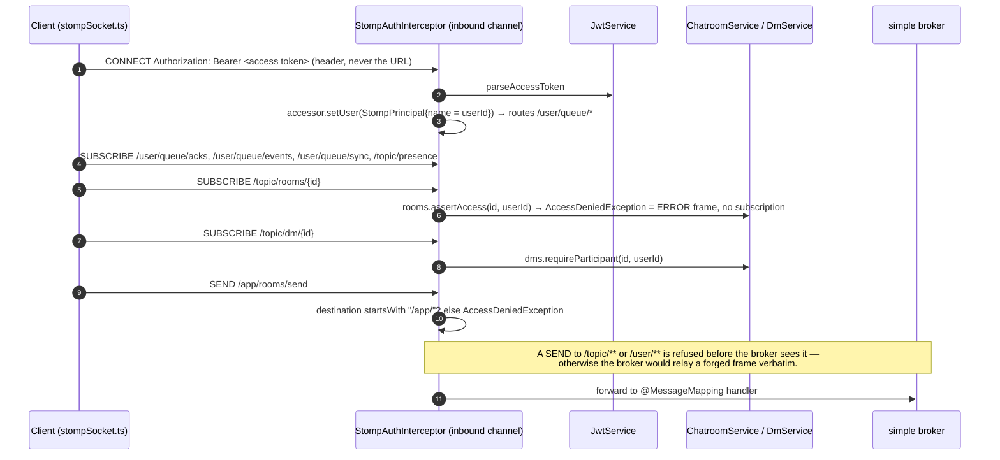

Authorisation is at SUBSCRIBE and SEND time only. A socket that outlives a logout, a password change or a room removal is not disconnected — an open item from the audit.

## 9. State machines

### Message delivery (client, `DeliveryState`)

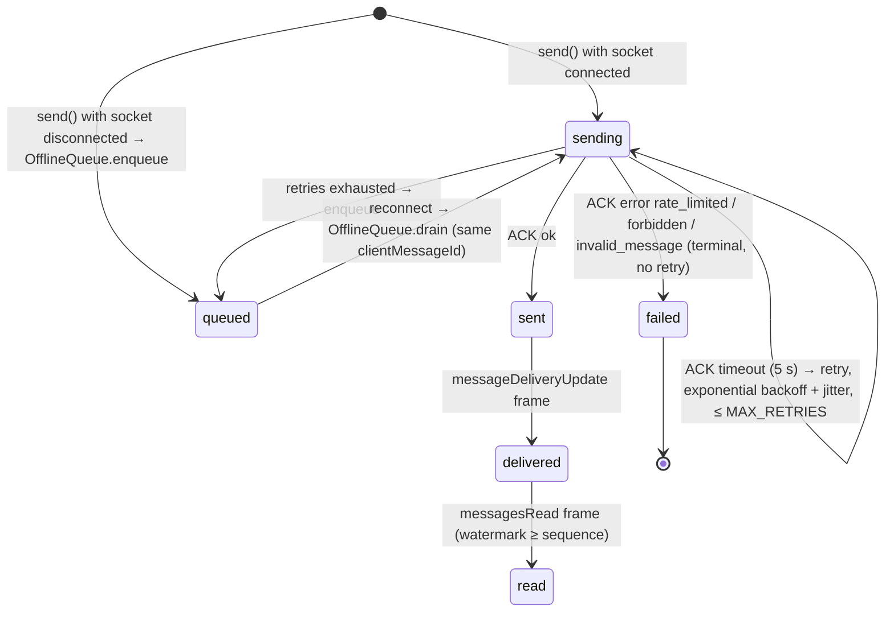

The same `clientMessageId` travels through every transition, which is what lets a retry, a queue drain and a service-worker flush all be absorbed as `duplicate: true` rather than becoming second rows.

### E2EE identity (client, `E2EEStatus`)

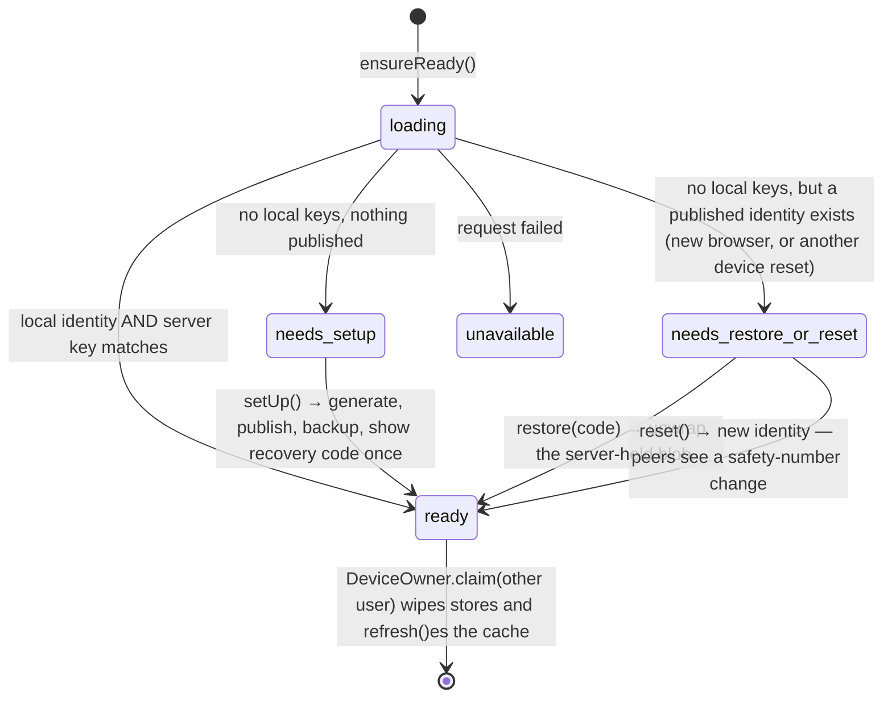

### Refresh-token row

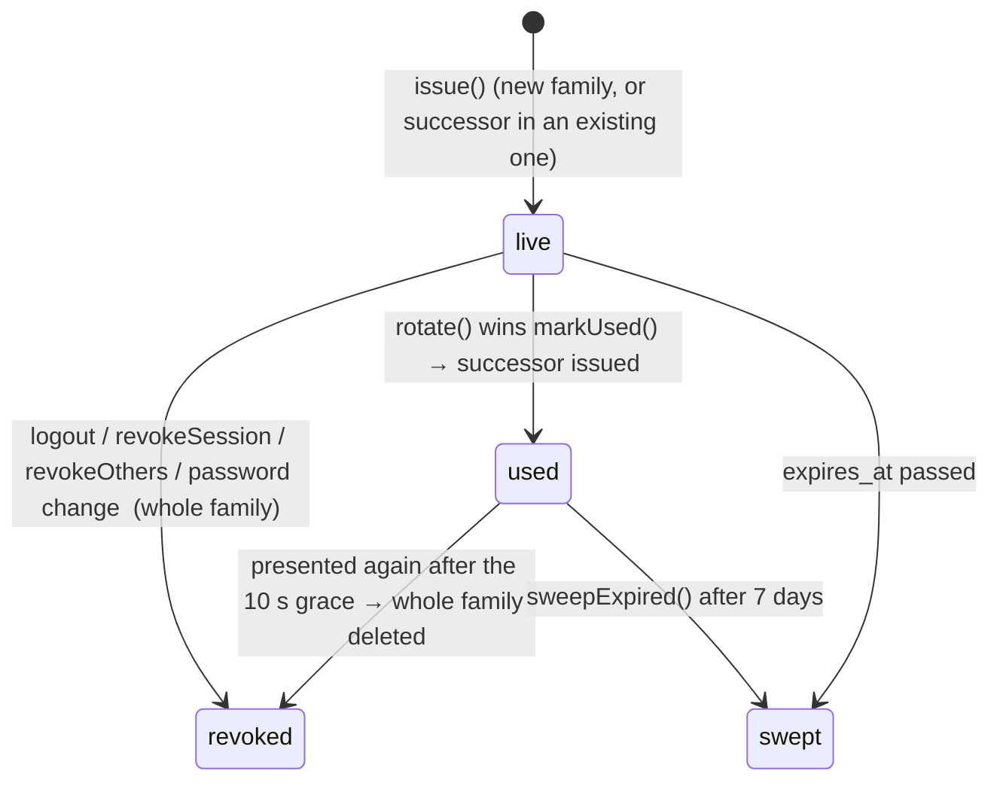

### Outbox publication (`event_publication` row)

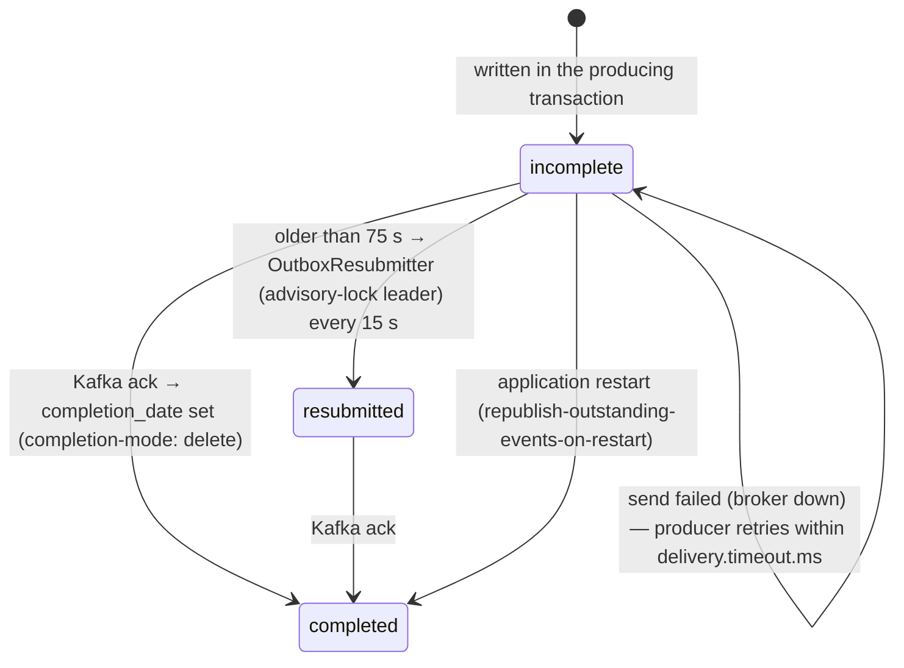

## 10. Client design

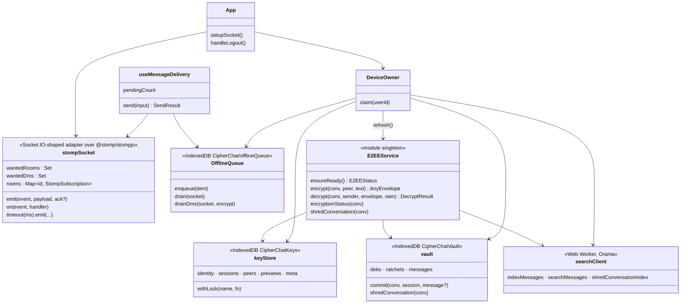

- **`stompSocket` keeps two sets.** *Wanted* subscriptions (what pages asked for) survive disconnects and are replayed on every connect; *live* subscriptions belong to one connection and are cleared with it. This is the fix for joins issued before the first connect completed.
- **Immutable crypto state.** `ratchetEncrypt`/`ratchetDecrypt`/`sealV2`/`openV2` return the *next* state instead of mutating; the caller decides when it is committed. The backend's CRDT types follow the same pattern.
- **Three IndexedDB databases, one owner.** `DeviceOwner.claim(userId)` runs before the socket or E2EE is touched after sign-in; a different user id wipes all three databases, the offline queue and the in-memory identity cache. The same user id is a no-op, so v2 history — whose only copy is the vault — survives an ordinary logout.

## 11. Transactions, locks and idempotency

| Where | Mechanism | Purpose |
|---|---|---|
| `MessagePersistence.persist`, `DmService.Persistence` | `REQUIRES_NEW` | Interpret a unique-index violation after rollback and answer `duplicate: true` instead of failing the request |
| `MessagePersistence.persist` | event published inside the tx | Message row + outbox row commit atomically |
| `AuthService.login/register` | `NOT_SUPPORTED` + `TransactionTemplate` | BCrypt (≈ 250 ms) never pins a pooled connection; only the audit + session insert are transactional |
| `RefreshTokenService.rotate` | `UPDATE … WHERE used_at IS NULL` returning 1 | Exactly one of N concurrent presenters wins, no lock, no version column |
| `RefreshTokenService.rotate` (reuse branch) | `REQUIRES_NEW` | Family revocation survives the caller throwing 401 |
| `AuditPublisher.publishDetached` | detached tx | A failed login's rollback cannot erase its own audit evidence |
| `ProcessedEventLedger.claim` | `MANDATORY` + `ON CONFLICT DO NOTHING` | Claim and side effect are one transaction; redelivery is a no-op |
| `OutboxResubmitter.resubmit` | `pg_try_advisory_xact_lock` | One replica resubmits per tick; released at commit, a crashed pod cannot strand it |
| `RedisSequenceCounter.next` | `SET NX` then `INCR` | Concurrent seeders cannot reset the counter; `UNIQUE (chatroom_id, sequence_number)` backstops it |
| `RedisDeduplicator` | `SET NX EX 600` keyed `dedup:<room>:<clientId>` | Fast-path duplicate answer across replicas; scoped per room |
| `RedisRateLimiter` | one Lua script (refill + consume) | Token bucket shared by all replicas with no read-modify-write race |
| `messages` | `UNIQUE (chatroom_id, client_message_id)` | Idempotency backstop, per room |
| `dm_messages` | `UNIQUE (conversation_id, sender_id, session_id, ctr)` | E2EE replay backstop, cluster-wide |
| `vault.commit` (client) | one IndexedDB transaction | Ratchet advance and its plaintext persist together or not at all |
| `keyStore.withLock` (client) | `navigator.locks` | One tab ratchets a conversation at a time; the other finds the plaintext in the vault |
| `dek()` (client) | `add`, not `put` | A racing tab cannot replace a conversation key already in use |

## 12. Error model

Every expected failure is an `ApiException(status, code, message)`; `GlobalExceptionHandler` renders it as an RFC 9457 problem document. Clients branch on `code`, never on the message.

| Code | Status | Raised by | Client behaviour |
|---|---|---|---|
| `validation_failed` (+ `fields`) | 400 | bean validation | show per-field |
| `invalid_message`, `invalid_envelope` | 400 | services, `EnvelopeValidator` | terminal, no retry |
| `bad_credentials`, `2fa_bad_code`, `2fa_pending_invalid`, `refresh_invalid`, `unauthorized` | 401 | auth | back to sign-in; `refresh_invalid` clears the cookie |
| `forbidden` | 403 | `assertAccess`, `requireParticipant`, role checks | terminal |
| `not_found` variants | 404 | services | terminal |
| `no_keys` | 404 | key directory | peer has no E2EE keys — the DM page currently falls back to `plaintext-legacy` (audit item) |
| `replayed_counter` | 409 | DM replay index | never retry with the same counter |
| `pii_detected` | 422 | `PiiGuard` | nothing was sent to the model; fix redaction |
| `rate_limited` | 429 | `RedisRateLimiter`, `AuthThrottle` | terminal for a send; back off |
| `redis_unavailable` | 503 | `RedisSequenceCounter` | retry with backoff (same `clientMessageId`) |
| `ai_unavailable`, `ai_not_configured` | 503 | `LlmClient` circuit breaker | show as unavailable |
| `server_error` | 500 | catch-all | STOMP ACK path retries; REST does not |

Over STOMP the same codes arrive in `Ack.error`; `useMessageDelivery.terminalAckError` decides which are terminal (`rate_limited`, `forbidden`, `invalid_message`) and which retry (timeout, `server_error`).

## 13. Concurrency and resource limits

| Resource | Setting | Reason |
|---|---|---|
| HikariCP pool | 20 per pod (`DB_POOL_SIZE`; 10 each in the two-replica profile) | Postgres `max_connections=200` shared by replicas, consumers and the outbox |
| Fan-out executor | dedicated `ThreadPoolTaskExecutor`, queue-backed | Fan-out must never block the committing request thread (load-found defect) |
| Kafka consumer concurrency | 3 per topic, 6 partitions | Parallelism ceiling per consumer group; partition key = room / conversation / user keeps per-entity order |
| STOMP inbound message size | 64 KB | An E2EE envelope with its init block is < 2 KB |
| STOMP send buffer / send time | 512 KB / 10 s | A slow subscriber is disconnected rather than allowed to hold memory |
| Heartbeats | 25 s both ways | Dead sockets are detected within ~50 s |
| Presence TTL | 90 s (heartbeat every 30 s) | A pod that dies without disconnects expires its users instead of ghosting them |
| Typing TTL | 4 s | Keys expire on their own if the owning pod dies |
| Message rate limit | burst 20, refill 2/s per user | Shared bucket across replicas |
| Auth throttle | 100/15 min per address; 10/15 min per (address, account); 10/5 min per account on 2FA | Bounds guessing and BCrypt CPU without offering a lock-out lever |
| Dedup cache TTL | 10 min | Bounds Redis memory; the unique index covers anything older |
| Refresh-token retention | used rows 7 days | Bounds the table; a replay older than that is refused as unknown anyway |
| `processed_events` retention | a little over Kafka retention | A redelivery older than retention cannot occur |
| Double Ratchet skipped keys | 1000 per step, 2000 stored | A malicious peer cannot force unbounded key derivation |
